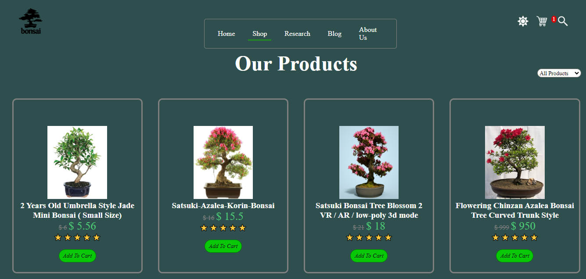
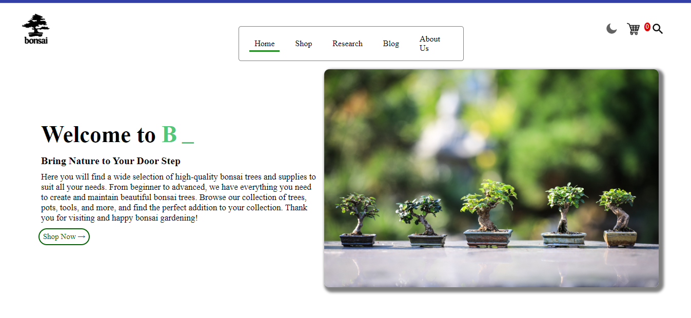

# Bonsai Ghar

### Introduction
  Bonsai Ghar, A site for selling or buying your bonsai plants.
  A fail safe and user friendly system integrated with the concepts of internet and web programming that guarantees data safety and user interactive features that builds trust among a user    and the administrator which is fruitful for both the parties involved in the system. 
  Tools Used: Front-end: HTML, CSS, JavaScript
  
### Screenshots:
  
    

### Features
    * Dark Mode
    * Add to card
    * All available pages
    * Typewriter effect
    

### Official SIte
https://bonsaighar.netlify.app/
